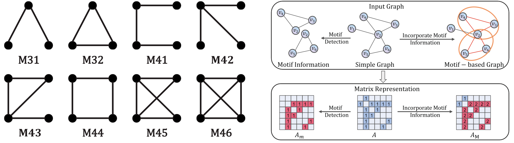
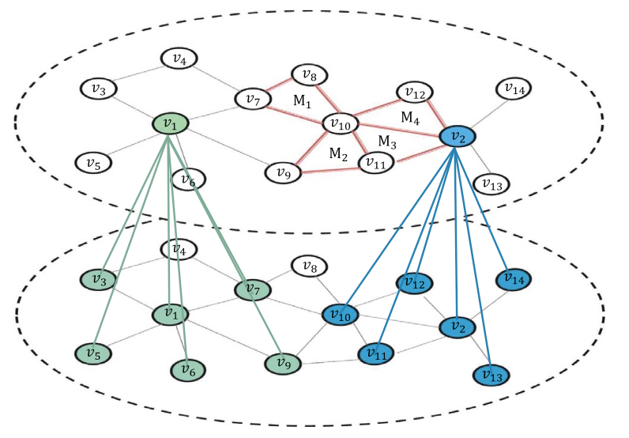
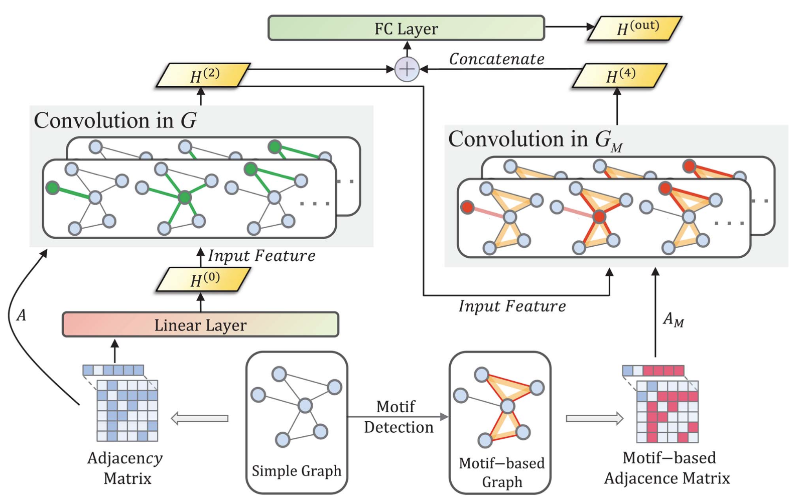

# Extracting Higher-Order Topological Semantic via Motif-based Deep Graph Neural Networks

## Overview

This repository provides the implementation of a novel approach to enhance graph neural networks (GNNs) by incorporating motif-based and simple graph convolution kernels. The proposed multi-level graph convolution framework aims to capture higher-order topological semantics and improve the representation of sparse networks. Our approach addresses the limitations of existing methods and demonstrates superior performance in various graph-related tasks.

## Authors

- **Ke-Jia Zhang**
- **Xiao Ding**
- **Bing-Bing Xiang**
- **Hai-Feng Zhang**
- **Zhong-Kui Bao**

_Corresponding Author: Zhong-Kui Bao_

## Abstract

Graph neural networks (GNNs) are efficient techniques for learning graph representations and have shown remarkable success in tackling diverse graph-related tasks. However, in the context of the neighborhood aggregation paradigm, conventional GNNs have limited capabilities in capturing the higher-order structures and topological semantics of graphs. Researchers have attempted to overcome this limitation by designing new GNNs that explore the impacts of motifs to capture potentially higher-order graph information. However, existing motif-based GNNs often ignore lower-order connectivity patterns such as nodes and edges, which leads to poor representation of sparse networks. To address these limitations, we propose an innovative approach. Firstly, we design convolution kernels on both motif-based and simple graphs. Secondly, we introduce a multi-level graph convolution framework for extracting higher-order topological semantics of graphs. Our approach overcomes the limitations of prior methods, demonstrating state-of-the-art performance in downstream tasks with excellent scalability. Extensive experiments on real-world datasets validate the effectiveness of our proposed method.

## Motif Detection



## Message Passing Paradigm of the GNNs.



## Model Overview



## Keywords

- Graph Neural Networks
- Graph Embedding
- Motif
- Link Prediction
- Node Classification

## Citation

If you use this code in your research, please cite our paper:

```
    @article{zhang2024extracting,
    title={Extracting Higher Order Topological Semantic via Motif-Based Deep Graph Neural Networks},
    author={Zhang, Ke-Jia and Ding, Xiao and Xiang, Bing-Bing and Zhang, Hai-Feng and Bao, Zhong-Kui},
    journal={IEEE Transactions on Computational Social Systems},
    year={2024},
    publisher={IEEE}
    }
```
